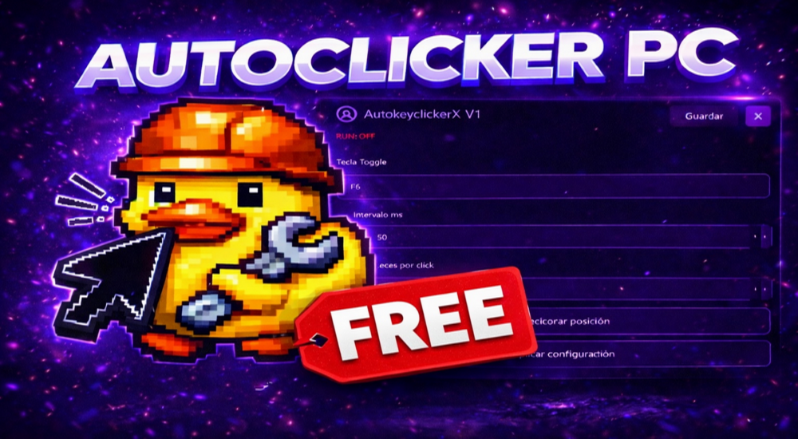

# 🖱️ AutokeyclickerX V1

**AutokeyclickerX V1** es una herramienta avanzada de automatización de clics diseñada para ofrecer precisión, rendimiento y personalización total. Ideal para usuarios que necesitan optimizar tareas repetitivas de forma eficiente y controlada.

---

## 🚀 Características Principales

- 🎯 Auto click de alta precisión
- ⏱️ Intervalos totalmente configurables (ms, segundos, personalizados)
- 💾 Guardado y carga de configuraciones
- 🧠 Sistema optimizado de ejecución eficiente
- 🖥️ Interfaz intuitiva y fácil de usar
- ⚡ Bajo consumo de recursos
- 🔁 Soporte para bucles y ejecución continua
- 🎛️ Control total sobre comportamiento del clic
- 📦 Portable (puede ejecutarse sin instalación)

---

## 🖥️ Compatibilidad

AutokeyclickerX V1 es compatible con:

- ✅ Windows 10
- ✅ Windows 11
- ⚙️ Arquitecturas x64 y x86

> ⚠️ Puede requerir permisos de administrador dependiendo del entorno de uso.

---

## 💾 Gestión de Configuración

La aplicación permite:

- Guardar configuraciones personalizadas
- Cargar perfiles previamente guardados
- Reutilizar setups para distintos escenarios
- Facilitar flujos de trabajo automatizados

---

## ⚠️ Aviso Legal

El autor de **AutokeyclickerX V1** no se hace responsable del uso indebido de esta herramienta.

Este software se proporciona con fines educativos y de automatización legítima. El usuario asume toda la responsabilidad derivada de su uso.

El uso de esta herramienta en plataformas, servicios o videojuegos que prohíban automatización puede conllevar:

- Suspensión de cuentas  
- Bloqueos permanentes  
- Otras sanciones aplicables  

**Al utilizar este software, aceptas que el autor queda exento de cualquier responsabilidad por daños directos o indirectos.**

---

## 📜 Licencia

Este proyecto está bajo la licencia **GNU General Public License v3.0 (GPL-3.0)**.

Esto implica que:

- Puedes usar, estudiar y modificar el software libremente
- Puedes redistribuir copias del software
- Las modificaciones deben mantenerse bajo la misma licencia
- Debes incluir el aviso de copyright original

Para más información, consulta el archivo `LICENSE`.

---

## ❤️ Donaciones

Si quieres apoyar el desarrollo de este proyecto, puedes hacerlo aquí:

👉 https://donate.stripe.com/9B68wQeyidMqgsz0yC8g001

Tu apoyo permite seguir mejorando la herramienta y añadir nuevas funcionalidades 🚀

---

## 🤝 Contribuciones

Las contribuciones son bienvenidas y apreciadas.

1. Haz un fork del repositorio  
2. Crea una rama (`feature/nueva-feature`)  
3. Realiza tus cambios  
4. Envía un pull request  

---

## 📌 Autor

Proyecto desarrollado de forma independiente.

---

## 🚀 Estado del Proyecto

🟢 En desarrollo activo  
🔄 Mejoras continuas y nuevas funciones en camino  

---

## 💡 Uso Responsable

Utiliza esta herramienta de manera ética y conforme a las normas de las plataformas donde la emplees.
